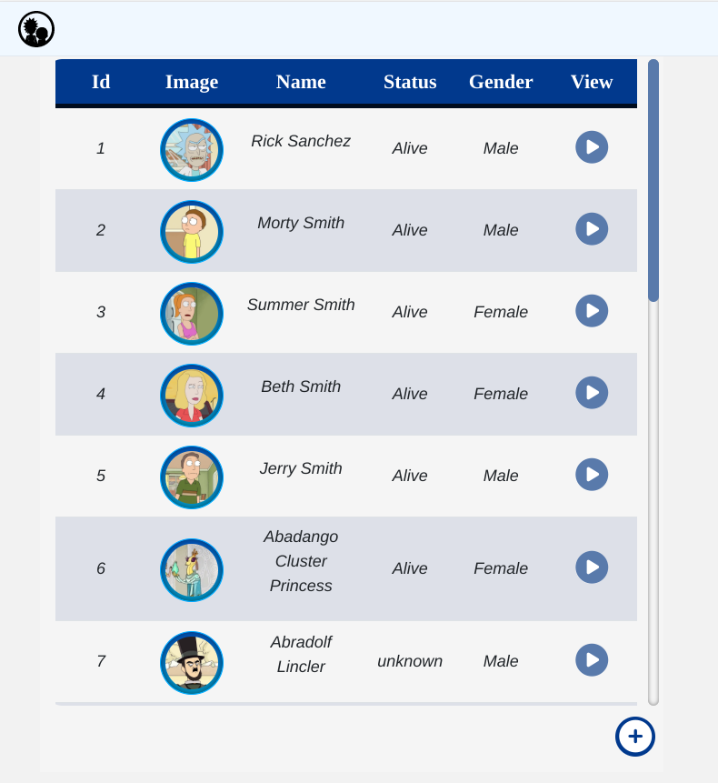
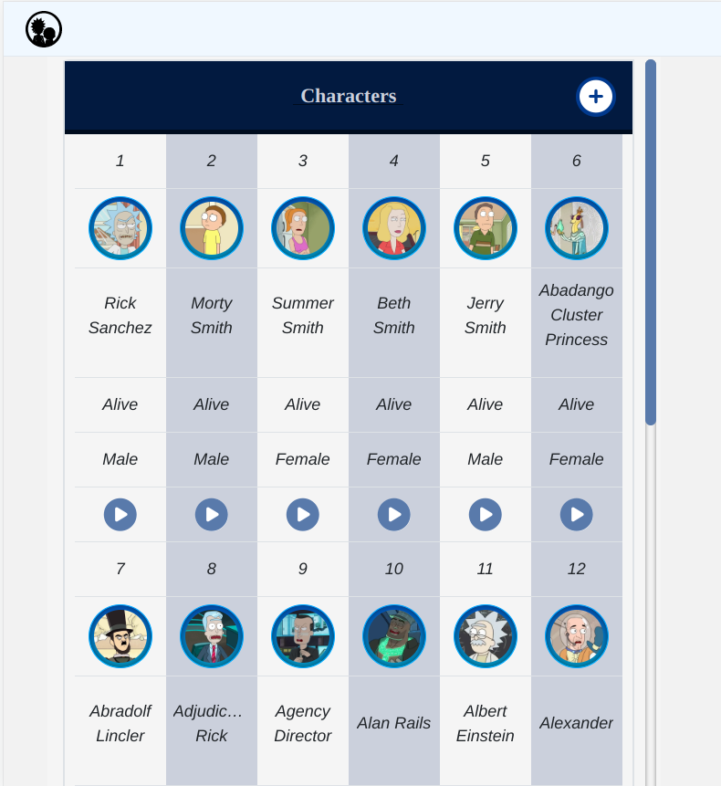
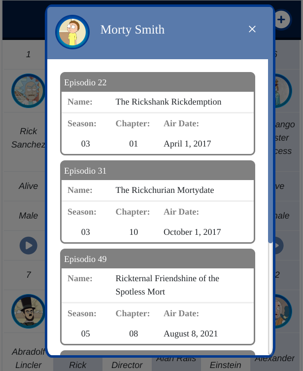
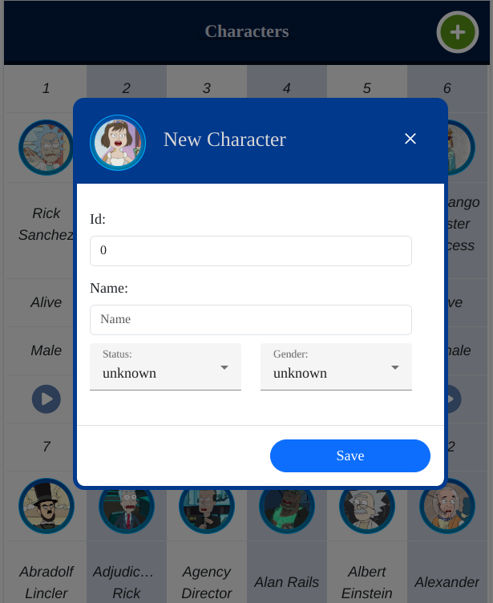
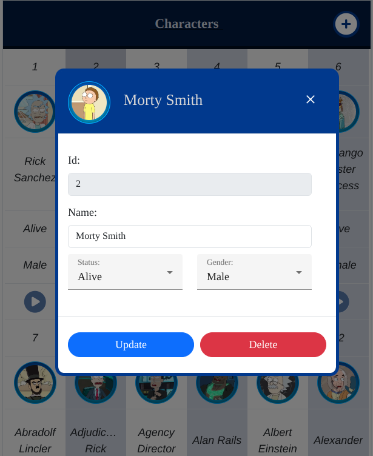

# RickMorty 
                 

RickMorty: Es un proyecto frontend desarrollado en [Angular CLI](https://github.com/angular/angular-cli) versión 15.1.4, el cual consume la API [Rick and Morty](https://rickandmortyapi.com/) mostrando los personajes previamente creados y almacenados en una base de datos. La API de [Rick and Morty](https://rickandmortyapi.com/), consta 826 personajes de la serie de televisión animada estadounidense creada por Justin Roiland y Dan Harmon en 2013, ordenados en una base de datos por medio de 42 páginas.
### Technologies:

  
  

## Description:
Los personajes se presentan en una tabla dinámica ordenados por ID. La tabla muestra 5 características de cada personaje: `id`, `image`, `name`, `status` y `gender`.

 

 
 

Al final de cada registro, un botón le permitirá tener acceso a la información de máximo de cinco episodios seleccionados aleatoriamente en los que ha aparecido el personaje a traves de un cuadro de diálogo de visualización, mostrando las siguientes características: `name`, `season`, `episode` y `air date`.

 

 

El usuario puede interactuar con el presente proyecto de forma local. Este, le permite crear, actualizar y eliminar personajes temporalmente. El sistema permitirá la creación de un personaje ficticio asignandole una imagen aleatoria de las existentes.

 

 
 

## Instalación:
1. Instale [Node.js](https://nodejs.org/es) y el administrador de paquetes `npm`.
2. Instale la [Angular CLI](https://angular.io/cli).
3. Abra una instancia de la *Terminal de Comandos* y ubiquese en el directorio raiz del proyecto `~.../RickMorty`,
4. **--TERMINAL--** Clone el repositorio ejecutando el comando `git clone https://github.com/daochoam/RickMorty.git`.
5. **--TERMINAL--** Instale el proyecto ejecutando el comando `npm install`..
   **NOTA:** Este proyecto fue construido el 22 de Marzo de 2023, ejecute el comando `npm update` para actualizar las librerias empleadas.
6. **--TERMINAL--** Corra el proyecto ejecutando el comando  `ng serve` o `npm start`. Ejecute `http://localhost:4200/` en el navegador.. Esta aplicación se recargará automáticamente si alguno de los archivos de origen cambia.
